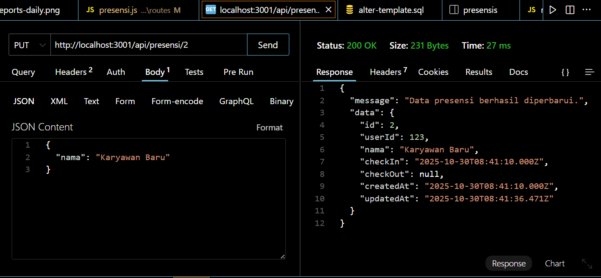
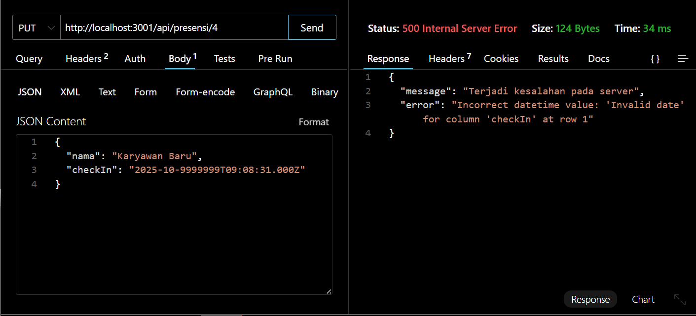
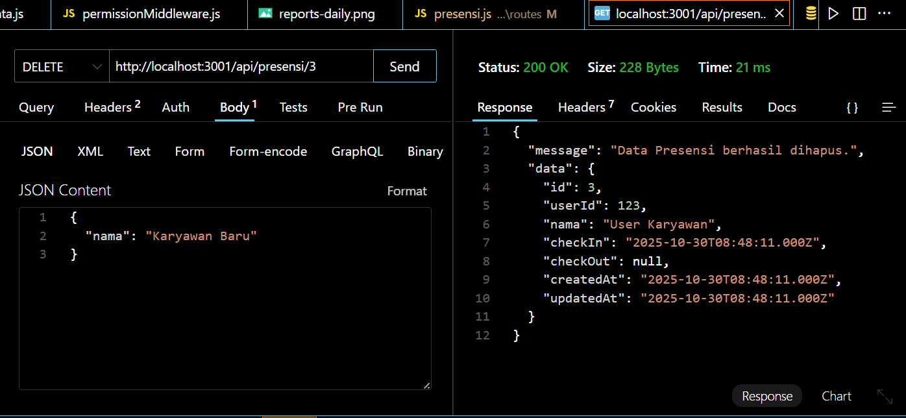
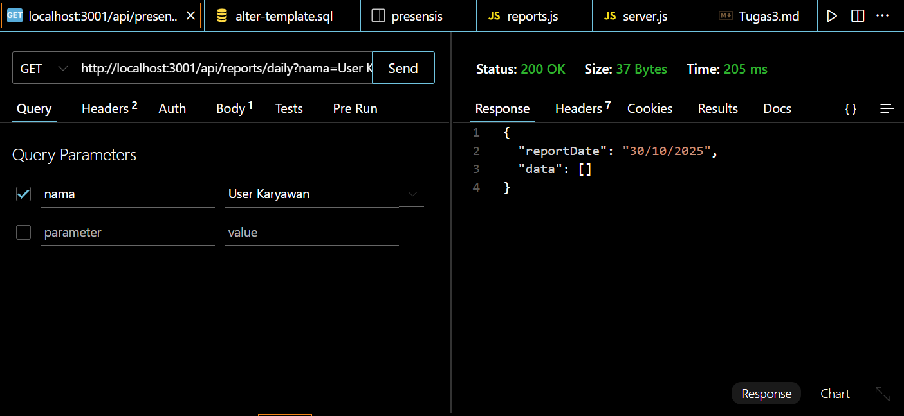
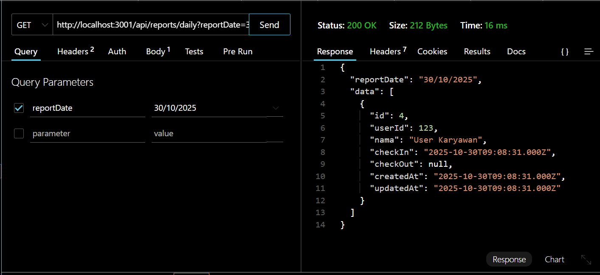

# Tugas 5

Tampilan update data presensi:

Tampilan update jika format tanggal yang diisi tidak valid:

Tampilan delete data:

Tampilan search berdasarkan nama:

Tampilan search berdasarkan tanggal:
